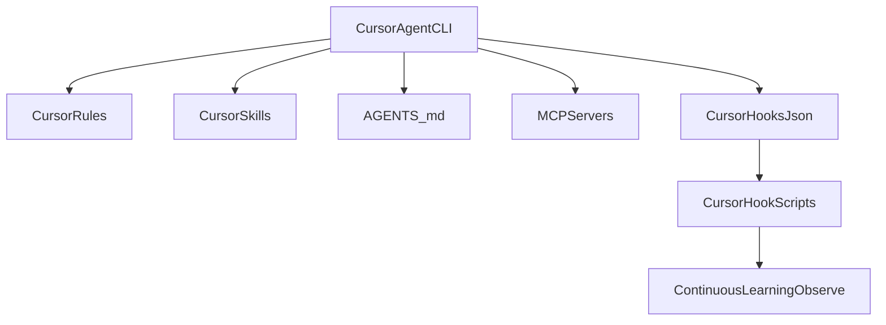

# Cursor

Audit date: `2026-03-08`

Status:
- `official`
- `locally-verified`
- `experimental` for MDT's current hook adapter (optional safety layer, not required for MDT workflows)

Local versions and binaries seen:
- `cursor --version` -> `2.6.13`
- `agent --help` launches Cursor Agent
- `cursor-agent --help` is also available locally

## MDT-Relevant Native Surfaces

- project/user rules
- `AGENTS.md`
- custom commands
- skills (`.cursor/skills/`, `~/.cursor/skills/`)
- memories
- background agents
- terminal agent / CLI
- MCP from the CLI

These are official Cursor surfaces and should be treated as the primary integration points.

## Native Surfaces vs MDT

| MDT Concern | Cursor surface | Repo status |
|---|---|---|
| Rules / project guidance | `.cursor/rules/` (project only); user-level rules are database-backed and cannot be file-installed | official (project scope only) |
| Commands | Cursor custom commands | official vendor surface with repo-installed MDT command prompts |
| Agents / delegation | custom modes, background agents, terminal agent | official |
| Skills / reusable workflows | `.cursor/skills/` (project) and `~/.cursor/skills/` (user); `SKILL.md` format with YAML frontmatter; auto-discovered and `/`-invocable | official |
| Persistent context | rules, memories, `AGENTS.md` | official |
| Automations / hooks | no vendor-documented equivalent to MDT `cursor-template/hooks.json` found during this audit | treat current repo hook path as `experimental` |
| MCP | Cursor CLI and agent can manage/use MCP | official |

## What MDT Currently Ships

The repo currently ships:
- `cursor-template/rules/` for project-level rules installed to `.cursor/rules/`
- `cursor-template/skills/frontend-slides/` plus package-selected shared skills from `skills/*/` (for example: `tdd-workflow`, `verification-loop`, `coding-standards`, `security-review`, `backend-patterns`, `frontend-patterns`, `e2e-testing`)
- `cursor-template/commands/*.md` for package-selected custom commands installed to `.cursor/commands/`
- `cursor-template/hooks.json` and `cursor-template/hooks/*.js` — an MDT-specific Cursor hook adapter

The rules and skills map directly onto official Cursor concepts.
The command files are repo-defined MDT prompt bodies for Cursor custom commands, not vendor-provided built-ins.

The hook layer is not yet something future agents should assume is an official Cursor feature. Until Cursor publishes that surface clearly, treat:
- `cursor-template/hooks.json`
- `cursor-template/hooks/*.js`
- `hooks/cursor/*`

as MDT's `experimental` Cursor adapter, not as vendor truth. MDT workflows must continue to function when these files are ignored by Cursor.

## Syntax and Paths To Prefer

### Official guidance surfaces

- Rules in `.cursor/rules/` — **project-scope only**; user-level rules are stored in a database and cannot be file-installed
- Skills in `.cursor/skills/` (project) or `~/.cursor/skills/` (user) — `SKILL.md` with YAML frontmatter
- `AGENTS.md` at repo root
- custom commands in Cursor's documented command system
- memories in Cursor's documented memory system
- background agents for delegated/async workflows

### Terminal agent

Local CLI evidence:

```bash
agent --help
cursor agent --help
cursor-agent --help
```

The installed terminal agent supports:
- `--mode plan`
- `--mode ask`
- `--resume`
- `--model`
- `--sandbox`
- `mcp`
- `generate-rule`

That makes Cursor a viable official target for planning, Q&A, MCP, and rule-generation workflows even without assuming hook parity.

## What Not To Assume

- Do not assume `cursor-template/hooks.json` is official just because it exists in this repo.
- Do not assume every shared MDT slash command has a Cursor counterpart unless it is actually shipped under `cursor-template/commands/` and declared by a package manifest.
- Skills are a first-class Cursor concept. Use `.cursor/skills/` with `SKILL.md` files — same format as Claude Code and Codex. Do not convert skills to rules when the skill format is the right fit.
- Do not attempt to file-install user-level rules into `~/.cursor/rules/`. Cursor stores user rules in a database; only project-level rules (`.cursor/rules/`) are file-based and installable by MDT.
- Do not force Claude hook semantics onto Cursor when rules, memories, background agents, or commands achieve the same MDT outcome more cleanly.

## Hooks Adapter Scope and Opt-In

- MDT installs `.cursor/hooks.json` and `.cursor/hooks/*.js` as an **experimental** adapter that mirrors Claude-style hook behavior for things like dev-server blocking, console.log checks, and continuous learning.
- Cursor does not currently document this hook surface; future versions may ignore or change it.
- If you want to skip installing Cursor hooks entirely, run the installer with `MDT_SKIP_CURSOR_HOOKS=1` in the environment. MDT will still install rules, skills, agents, and custom command prompts.
- For adapter architecture and extension guidance, see [hooks/README.md](../../hooks/README.md#cursor-hook-adapter).

When documenting Cursor behavior in MDT, always describe the hooks adapter as experimental and optional. The primary, vendor-backed integration points are rules, skills, `AGENTS.md`, memories, background agents, and custom commands.

## MDT Cursor Integration Overview



## Local Verification Commands

```bash
cursor --version
cursor --help
agent --help
cursor agent --help
cursor-agent --help
```

Look for:
- `agent` subcommand in `cursor --help`
- plan/ask modes in `agent --help`
- MCP-related CLI support such as `--add-mcp`

## Source Links

- Rules: https://docs.cursor.com/en/context/rules
- AGENTS.md and rules together: https://docs.cursor.com/en/cli/using
- Custom commands: https://docs.cursor.com/en/agent/chat/commands
- Memories: https://docs.cursor.com/en/context/memories
- Background agents: https://docs.cursor.com/en/background-agents/overview
- Terminal agent / CLI: https://docs.cursor.com/en/cli/agent
- Skills: https://cursor.com/docs/skills
