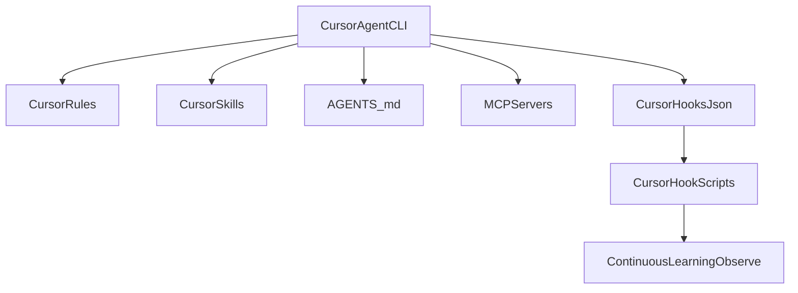

# Cursor

Audit date: `2026-03-11`

Status:
- `official`
- `locally-verified`
- `experimental` for MDT's current hook adapter (optional safety layer, not required for MDT workflows)

Local binaries seen:
- `agent --help` launches Cursor Agent
- `cursor-agent --help` is also available locally
- `cursor` is not on `PATH` in this shell, so Cursor desktop version was not re-verified here

## MDT-Relevant Native Surfaces

- project/user rules
- `AGENTS.md`
- custom commands
- skills (`.cursor/skills/`, `~/.cursor/skills/`)
- memories
- background agents
- terminal agent / CLI
- MCP from the CLI

These are official Cursor surfaces and should be treated as the primary integration points.

## Native Surfaces vs MDT

| MDT Concern | Cursor surface | Repo status |
|---|---|---|
| Rules / project guidance | `.cursor/rules/` (project, including Cursor IDE) and `~/.cursor/rules/*.mdc` (user/global via `cursor-agent`) | official, `locally-verified` |
| Commands | Cursor custom commands | official vendor surface with repo-installed MDT command prompts |
| Agents / delegation | custom modes, background agents, terminal agent | official |
| Skills / reusable workflows | `.cursor/skills/` (project) and `~/.cursor/skills/` (user); `SKILL.md` format with YAML frontmatter; auto-discovered and `/`-invocable | official |
| Persistent context | rules, memories, `AGENTS.md` | official |
| Automations / hooks | no vendor-documented equivalent to MDT `cursor-template/hooks.json` found during this audit | treat current repo hook path as `experimental` |
| MCP | Cursor CLI and agent can manage/use MCP | official |

## What MDT Currently Ships

The repo currently ships:
- `cursor-template/rules/` rendered as global `~/.cursor/rules/*.mdc`
- `cursor-template/skills/frontend-slides/` plus package-selected shared skills from `skills/*/` (for example: `tdd-workflow`, `verification-loop`, `coding-standards`, `security-review`, `backend-patterns`, `frontend-patterns`, `e2e-testing`)
- `cursor-template/commands/*.md` for package-selected custom commands installed to `~/.cursor/commands/`
- `cursor-template/hooks.json` and `cursor-template/hooks/*.js` — an MDT-specific Cursor hook adapter
- `~/.cursor/mdt/` for MDT-owned helpers, learning state, manifests, and future script-owned state

New local evidence:

- `cursor-agent` accepts user-global rule files under `~/.cursor/rules/*.mdc`
- locally verified example:
  - `C:\Users\patri\.cursor\rules\never-attempt-to-read.mdc`
  - frontmatter includes `description` and `alwaysApply: true`

Important nuance:

- Cursor's official docs still describe user rules as database-backed rather than
  file-installed
- local testing shows `cursor-agent` will happily create and use
  `~/.cursor/rules/*.mdc`
- local verification last true on `2026-03-12` shows this is not just a
  possibility: Cursor IDE and `cursor-agent` currently behave differently here
- Cursor IDE reads project rules from the opened repository's
  `.cursor/rules/`
- Cursor IDE user-global rules appear to live in Cursor-managed app storage
  rather than `~/.cursor/rules/*.mdc`
- `cursor-agent` reads file-backed user-global rules from
  `~/.cursor/rules/*.mdc`
- until Cursor's official docs catch up, MDT should treat the user-global
  `.mdc` rule surface as `locally-verified` for `cursor-agent`, not as fully
  settled vendor-wide truth for every Cursor surface

Practical interpretation for MDT:

- treat Cursor IDE project rules and Cursor Agent user-global rules as distinct
  install surfaces
- do not describe `~/.cursor/rules/*.mdc` as a vendor-wide user-rule surface
  for all Cursor experiences
- do not describe repo-local `.cursor/rules/` as the same thing as Cursor Agent
  global rules; they differ in both scope and storage model

The rules and skills map directly onto official Cursor concepts.
The command files are repo-defined MDT prompt bodies for Cursor custom commands, not vendor-provided built-ins.

The hook layer is not yet something future agents should assume is an official Cursor feature. Until Cursor publishes that surface clearly, treat:
- `cursor-template/hooks.json`
- `cursor-template/hooks/*.js`
- `hooks/cursor/*`

as MDT's `experimental` Cursor adapter, not as vendor truth. MDT workflows must continue to function when these files are ignored by Cursor.

## Syntax and Paths To Prefer

### Official guidance surfaces

- Rules in `.cursor/rules/` (project) and `~/.cursor/rules/*.mdc`
  (user/global via `cursor-agent`; last locally true `2026-03-12`)
- Skills in `.cursor/skills/` (project) or `~/.cursor/skills/` (user) — `SKILL.md` with YAML frontmatter
- `AGENTS.md` at repo root
- custom commands in Cursor's documented command system
- memories in Cursor's documented memory system
- background agents for delegated/async workflows

### Terminal agent

Local CLI evidence:

```bash
agent --help
cursor-agent --help
```

The installed terminal agent supports:
- `--mode plan`
- `--mode ask`
- `--resume`
- `--model`
- `--sandbox`
- `mcp`
- `generate-rule`

That makes Cursor a viable official target for planning, Q&A, MCP, and rule-generation workflows even without assuming hook parity.

## What Not To Assume

- Do not assume `cursor-template/hooks.json` is official just because it exists in this repo.
- Do not assume every shared MDT slash command has a Cursor counterpart unless it is actually shipped under `cursor-template/commands/` and declared by a package manifest.
- Skills are a first-class Cursor concept. Use `.cursor/skills/` with `SKILL.md` files — same format as Claude Code and Codex. Do not convert skills to rules when the skill format is the right fit.
- Do not assume project `.cursor/rules/*.md` and user `~/.cursor/rules/*.mdc` are interchangeable. Local evidence last true on `2026-03-12` shows Cursor IDE uses repo-local `.cursor/rules/` for project scope, while `cursor-agent` accepts user-global `.mdc` rule files from `~/.cursor/rules/`. MDT should treat them as separate install surfaces with different scope and storage behavior.
- Do not force Claude hook semantics onto Cursor when rules, memories, background agents, or commands achieve the same MDT outcome more cleanly.
- Do not assume live `.cursor/commands/*.md` files are the only source Cursor is consulting. Local troubleshooting showed Cursor can retain stale command/retrieval state under `AppData\\Roaming\\Cursor\\User\\workspaceStorage`, so command-path bugs should be checked against workspace cache as well as installed files.

## Command And Skill Path Hardening

Local troubleshooting showed two important Cursor behaviors:

1. Cursor can cache stale command/retrieval state under:
   - `AppData\Roaming\Cursor\User\workspaceStorage\...`
2. When command or skill paths are ambiguous, Cursor Agent may improvise by
   searching other tool directories such as `.claude/` or `.codex/` instead of
   staying inside the current `.cursor/` install surface.

Because of that, MDT guidance for Cursor should follow these rules:

- Prefer a single explicit Cursor path in installed command prompts.
- Do not give Cursor multiple equivalent path options unless that flexibility is
  truly required.
- In normal installed Cursor command files, prefer:
  - `~/.cursor/...`
  - `~/.cursor/mdt/...`
  over generic placeholders or cross-tool examples.
- If the required Cursor path is missing, tell Cursor to report the
  install as incomplete rather than guessing another tool path.
- When debugging surprising Cursor behavior, check:
  1. the live `.cursor/...` files
  2. stale detached `node.exe` helper/observer processes
3. `workspaceStorage` cache

Current observer lifecycle behavior:

- the detached continuous-learning observer now uses a managed lease file at
  `~/.cursor/mdt/homunculus/<project-id>/.observer.pid`
- MDT still keeps that path stable for compatibility, but the preferred file
  content is now JSON rather than a plain PID
- `start-observer.js stop` removes the lease as well as sending a best-effort
  `SIGTERM`
- if an older detached observer outlives its lease or is replaced by a newer
  instance, it should now self-terminate instead of lingering indefinitely

Treat Cursor as an integration that benefits from strict, tool-local prompts and
explicit troubleshooting steps. Do not assume it will remain path-faithful when
given ambiguous instructions.

## Local Bridge Exception

MDT installs Cursor globally by default for the `cursor-agent` surface. If a
specific workflow also needs repo-local Cursor IDE rules, use the installed
Cursor custom command:

```text
/install-rules
```

That command copies the rules currently installed under `~/.cursor/rules/` into
the opened repo's `.cursor/rules/`.

Equivalent shell command:

```bash
node ~/.cursor/mdt/scripts/materialize-mdt-local.js --target cursor --surface rules
```

That materializes only the local `.cursor/rules/` bridge for the current repo.
It is not a full project-local MDT install, and it does not replace the global
`~/.cursor/` install used by `cursor-agent`.

## Hooks Adapter Scope and Opt-In

- MDT installs `~/.cursor/hooks.json` and `~/.cursor/mdt/hooks/*.js` as an **experimental** adapter that mirrors Claude-style hook behavior for things like dev-server blocking, console.log checks, and continuous learning.
- Cursor does not currently document this hook surface; future versions may ignore or change it.
- If you want to skip installing Cursor hooks entirely, run the installer with `MDT_SKIP_CURSOR_HOOKS=1` in the environment. MDT will still install rules, skills, agents, and custom command prompts.
- For adapter architecture and extension guidance, see [hooks/README.md](../../hooks/README.md#cursor-hook-adapter).

When documenting Cursor behavior in MDT, always describe the hooks adapter as experimental and optional. The primary, vendor-backed integration points are rules, skills, `AGENTS.md`, memories, background agents, and custom commands.

## MDT Cursor Integration Overview



## Local Verification Commands

```bash
agent --help
cursor-agent --help
```

Look for:
- plan/ask modes in `agent --help`
- MCP-related CLI support such as the `mcp` command

## Source Links

- Rules: [docs.cursor.com/en/context/rules](https://docs.cursor.com/en/context/rules)
- AGENTS.md and rules together: [docs.cursor.com/en/cli/using](https://docs.cursor.com/en/cli/using)
- Custom commands: [docs.cursor.com/en/agent/chat/commands](https://docs.cursor.com/en/agent/chat/commands)
- Memories: [docs.cursor.com/en/context/memories](https://docs.cursor.com/en/context/memories)
- Background agents: [docs.cursor.com/en/background-agents/overview](https://docs.cursor.com/en/background-agents/overview)
- Terminal agent / CLI: [docs.cursor.com/en/cli/agent](https://docs.cursor.com/en/cli/agent)
- Skills: [cursor.com/docs/skills](https://cursor.com/docs/skills)
